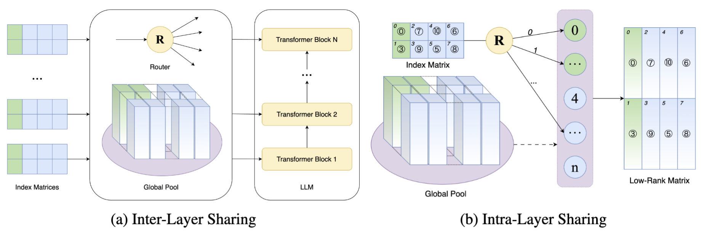

<h1 align="center">
<br>
MoS: Unleashing Parameter Efficiency of Low-Rank Adaptation with Mixture of Shards
</h1>


<p align="center">
  <a href="https://arxiv.org/abs/2410.00938"><b>[📄 Paper]</b></a> •
  <a href="https://hub.docker.com/r/forence/open-instruct"><b>[🐳 Docker]</b></a> •
  <a href="https://github.com/Forence1999/MoS"><b>[🗁 GitHub]</b></a>
</p>

<p align="center">
🔥 Official repo for "<a href="https://arxiv.org/abs/2410.00938" target="_blank">MoS: Unleashing Parameter Efficiency of Low-Rank Adaptation with Mixture of Shards</a>".
</p>
<p align="center">
❗️ Most of files are inherited from AllenAI's great <a href="https://github.com/allenai/open-instruct" target="_blank">work</a>. We show our greatest respect to their efforts, and all the relevant rights are reserved for the ORIGINAL authors!
</p>

<p align="center">
  
</p>


## 🔥 News
- [2025/01/23] 🔥🔥🔥 MoS is accepted by ICLR 2025 (Poster)!


## 💡 Abstract
The rapid scaling of large language models necessitates more lightweight finetuning methods to reduce the explosive GPU memory overhead when numerous customized models are served simultaneously. Targeting more parameter-efficient low-rank adaptation (LoRA), parameter sharing presents a promising solution. Empirically, our research into high-level sharing principles highlights the indispensable role of differentiation in reversing the detrimental effects of pure sharing. Guided by this finding, we propose Mixture of Shards (MoS), incorporating both inter-layer and intra-layer sharing schemes, and integrating four nearly cost-free differentiation strategies, namely subset selection, pair dissociation, vector sharding, and shard privatization. Briefly, it selects a designated number of shards from global pools with a Mixture-of-Experts (MoE)-like routing mechanism before sequentially concatenating them to low-rank matrices. Hence, it retains all the advantages of LoRA while offering enhanced parameter efficiency, and effectively circumvents the drawbacks of peer parameter-sharing methods. Our empirical experiments demonstrate approximately 8x parameter savings in a standard LoRA setting. The ablation study confirms the significance of each component. Our insights into parameter sharing and MoS method may illuminate future developments of more parameter-efficient finetuning methods. 

<!-- ## 🚀 -->

## 🔨 Implementation Roadmap

To facilitate the integration of MoS into your customized applications, we primarily utilizes the code line `share_lora_chunkwisely(model, chunk_config)` in `finetune_trainer.py` to substitute the loaded LoRA modules. For your customized application, you can easily deploy MoS by adding this code line after LoRA is loaded.

## ⚙️ Environment setting

### 🗁 Prepare GitHub Repo
```bash
# Clone the repo to local machine
git clone https://github.com/Forence1999/MoS.git
cd MoS
```


### 🐳 Docker

We recommend to setup the environment with our docker [image](https://hub.docker.com/r/forence/open-instruct), which will prepare the whole environment and ease your reproduction with minimal effort.

#### LLaMA2-7B and LLaMA2-13B

```bash
# Pull the image for finetuning on LLaMA2 from dockerhub
docker pull forence/open-instruct:v1

# Start the container, remember to replace <PROJECT_DIR> with your own project directory
docker run \
    --name mos_llama2 \
    --gpus all \
    --network=host \
    -v <PROJECT_DIR>:/workspace \
    -it forence/open-instruct:v1 /bin/bash

cd /workspace
```

#### LLaMA3.2-3B

```bash
# Pull the image for finetuning on LLaMA3 from dockerhub
docker pull forence/mop_llama3:v0

# Start the container, remember to replace <PROJECT_DIR> with your own project directory
docker run \
    --name mos_llama3 \
    --gpus all \
    --network=host \
    -v <PROJECT_DIR>:/workspace \
    -it forence/forence/mop_llama3:v0 /bin/bash

cd /workspace
```


### 🐍 Conda
If you use the above docker image, this step can be skipped, because the conda env has been well prepared in it.
```bash
# Create and activate conda environment
conda create -n mos python=3.11
conda activate mos

# Install required dependencies
pip install -r requirements.txt
```

## 📜 Datasets
The data preparation is inherited from the paper ["How Far Can Camels Go? Exploring the State of Instruction Tuning on Open Resources"](https://arxiv.org/abs/2306.04751) and  [open-instruct](https://github.com/allenai/open-instruct.git) github repo, which can be refered for deatiled information. For simplicity, you can download and process the datasets for both fine-tuning and evaluation with following scripts:

```bash
# Prepare the training data
./scripts/prepare_train_data.sh

# Prepare the evaluation data
./scripts/prepare_eval_data.sh
```

<!-- Benchmark for evaluation includes:
- [MMLU](https://github.com/hendrycks/test)
- [Grade School Math (GSM)](https://github.com/openai/grade-school-math)
- [Big-Bench Hard (BBH)](https://github.com/suzgunmirac/BIG-Bench-Hard/tree/main)
- [TydiQA](https://github.com/google-research-datasets/tydiqa)
- [Codex HumanEval](https://github.com/openai/human-eval/tree/master) -->


## 📃 Experiments

LLaMA series require addtional requests to download. For LLaMA2 models, please refer to [Hugging Face documentation for LLaMA](https://huggingface.co/docs/transformers/model_doc/llama2) for requesting the access token.

There are two alternative methods to pass the access token:
1. Pass as a parameter (Recommended)
  ```bash
  # Set the <HF_TOKEN> in the shell script and pass it as:
  --token ${HF_TOKEN}
  ```
2. Pass through environment variable
  ```bash
  python -c "from huggingface_hub.hf_api import HfFolder; HfFolder.save_token(<HF_TOKEN>)"
  ```

All the preparation work is done! Here's an example to fine-tune LLaMA2-7B with SuperNI and evaluation on MMLU. The running script is as follows:

```bash
# Before running the following script, please replace the <HF_TOKEN> with your own huggingface token
bash ft_llama2_7b_superni_mmlu.sh <LORA_RANK> <SEED> <GPU_ID> <LEARNING_RATE> <FINE-TUNE_MODE> <INIT_LORA_A_VEC_VALUE> <INIT_NORM_STD> <NUM_PRIVATE_RANK> <VALID_LORA_RANK> <NUM_CHUNK>
```
LoRA_r	Seed	GPU	Learning Rate	Fine-Tune_Mode	init_lora_A_vec_value	init_norm_std	valid_param_private_r	valid_param_lora_r	num_chunk

Here's a detailed description for each parameter:
- `LORA_RANK`: The rank of MoS, refered as the variable `r` in our paper.
- `SEED`: Random seed.
- `GPU_ID`: The id of GPU assigned for the run.
- `LEARNING_RATE`: Linear learning rate.
- `FINE-TUNE_MODE`: Set to "mos" by default to activate MoS.
- `INIT_LORA_A_VEC_VALUE`: The `mean` of the guassian disctribution used in `Random Scaling`.
- `INIT_NORM_STD`: The `standard deviation` of the guassian disctribution used in `Random Scaling`.
- `NUM_PRIVATE_RANK`: The number of equivalent lora ranks that are preserved private in `Shard Privatization`.
- `VALID_LORA_RANK`: Equivalent valid lora ranks for fine-tuning.
- `NUM_CHUNK`: Number of shards defined in `Vector Sharding`.


We also provide commands to postprocess and summarize the results, the running script is as follows:

```python
# For MMLU
python mmlu_summarize.py --ts <TIME_SPAN>

# For TydiQA
python mmlu_summarize.py --ts <TIME_SPAN>
```
- `TIME_SPAN`: Duration of the present time from its last modification time in hours to be considered in result summary.


## © Citation

If you find our wrok helpful, please kindly cite the paper as follows:
```
@article{wang2025mos,
      title={MoS: Unleashing Parameter Efficiency of Low-Rank Adaptation with Mixture of Shards}, 
      author={Sheng Wang and Liheng Chen and Pengan Chen and Jingwei Dong and Boyang Xue and Jiyue Jiang and Lingpeng Kong and Chuan Wu},
      year={2025},
      eprint={2410.00938},
      archivePrefix={arXiv},
      primaryClass={cs.LG},
      url={https://arxiv.org/abs/2410.00938}, 
}
```